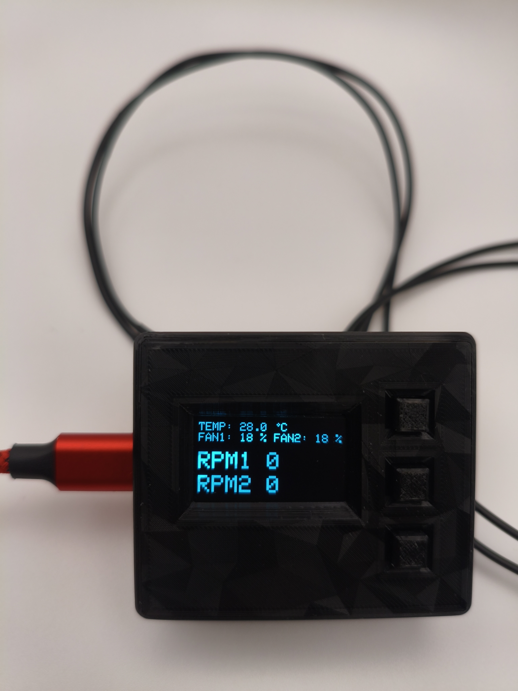
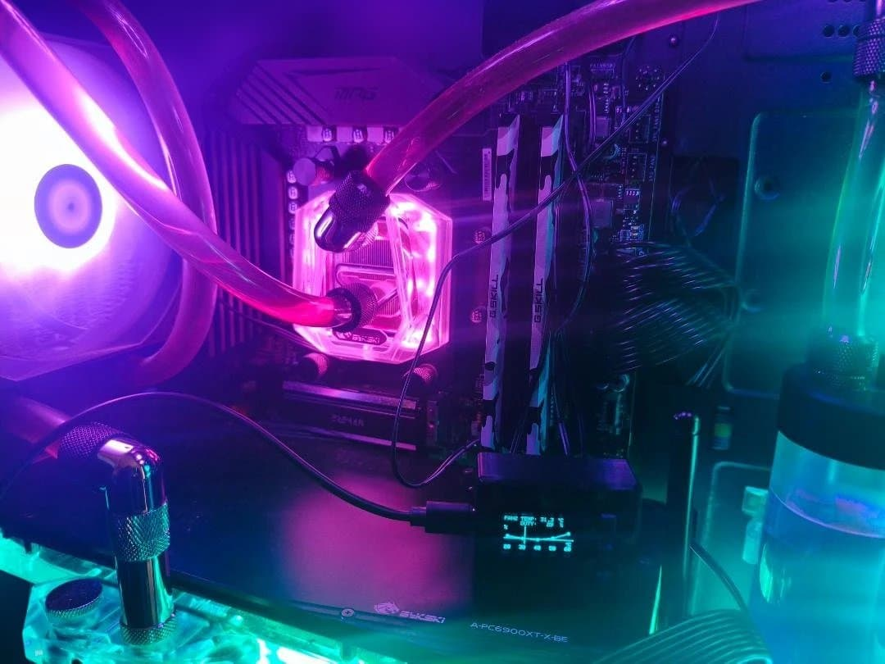
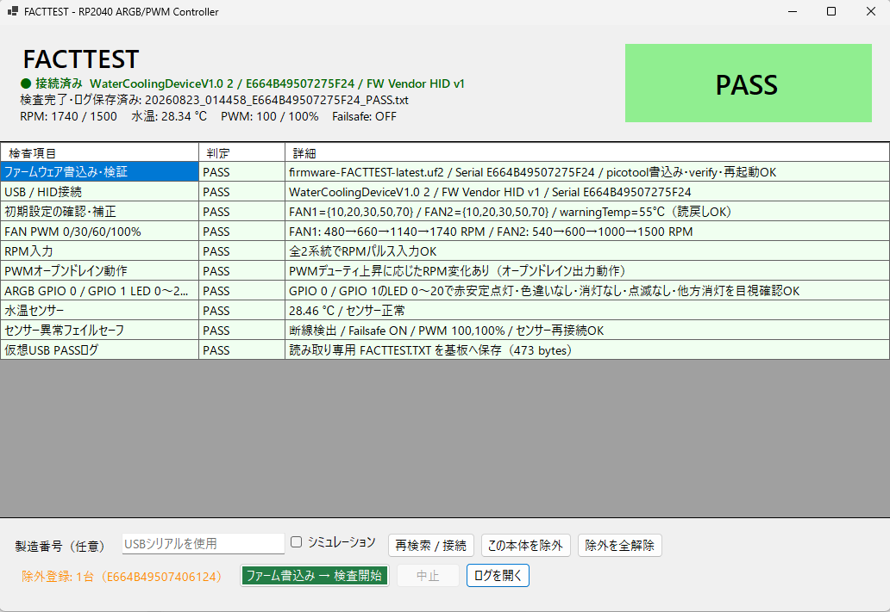
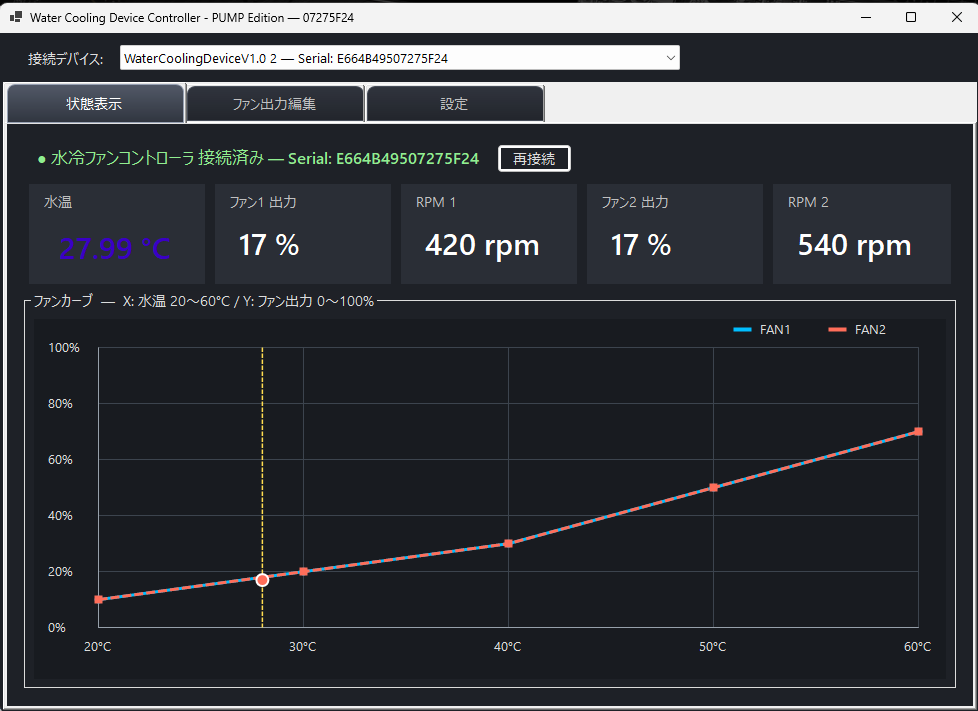
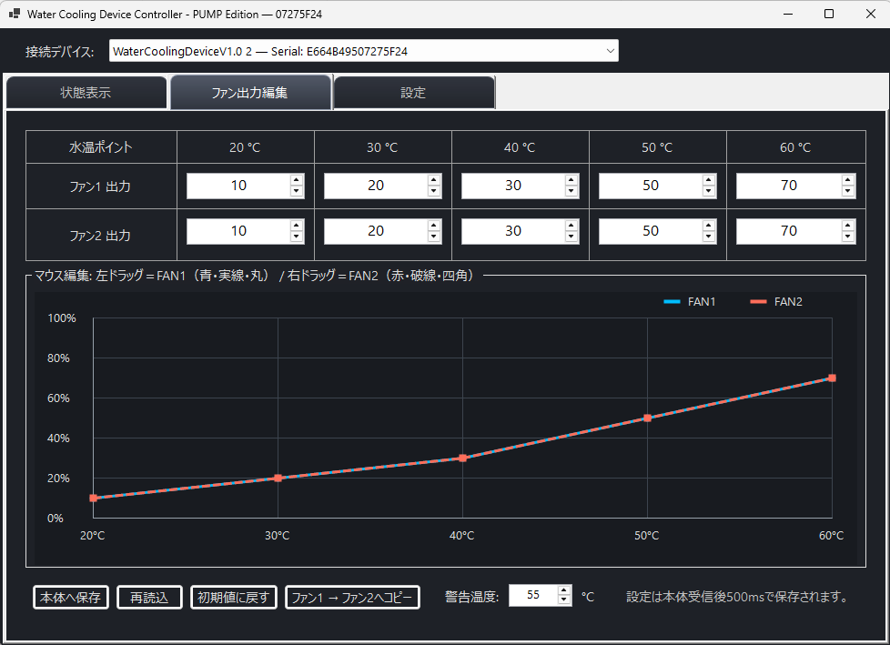
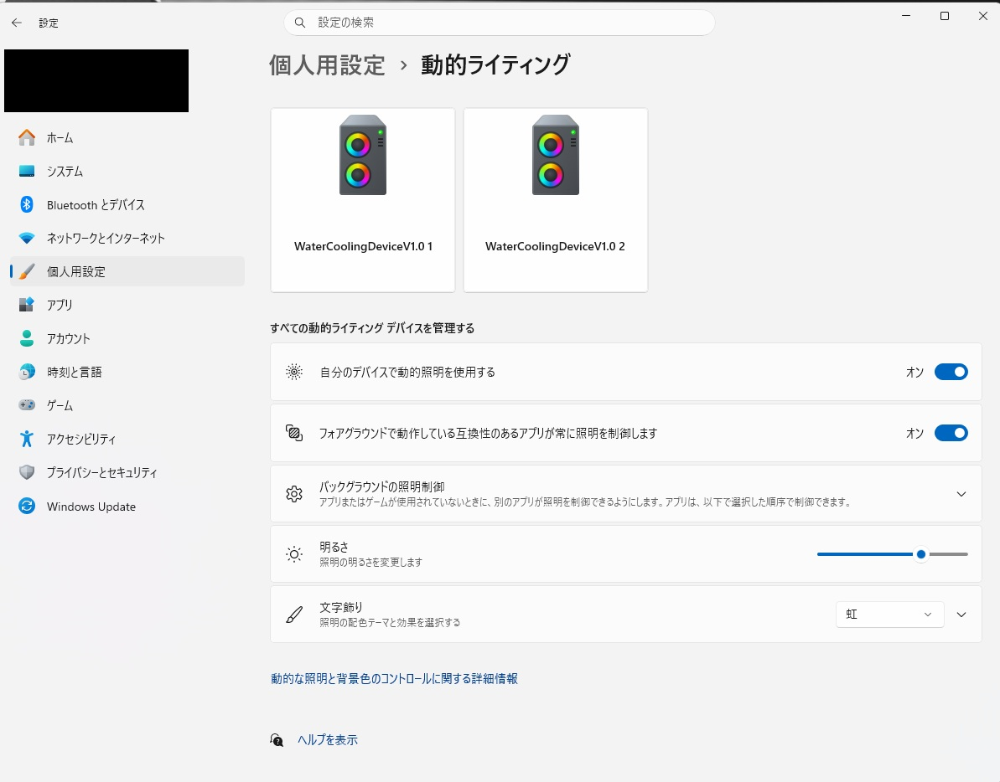
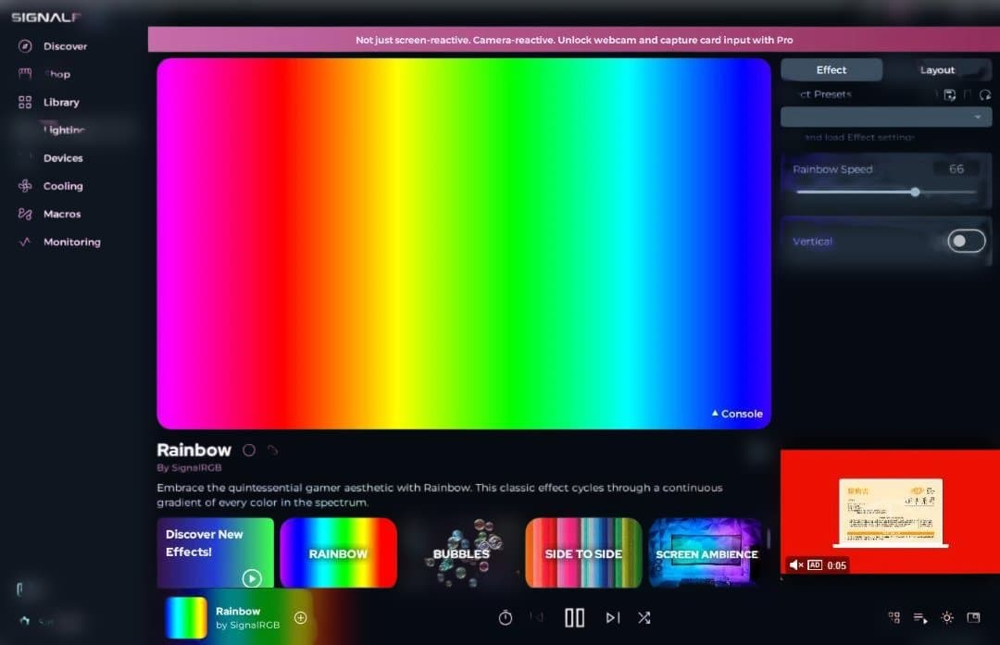
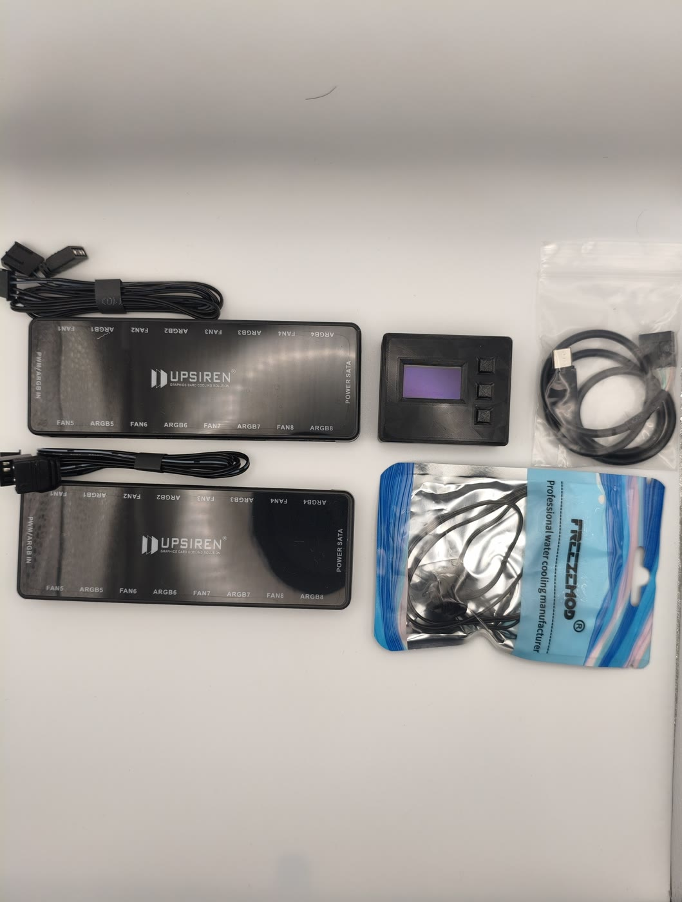
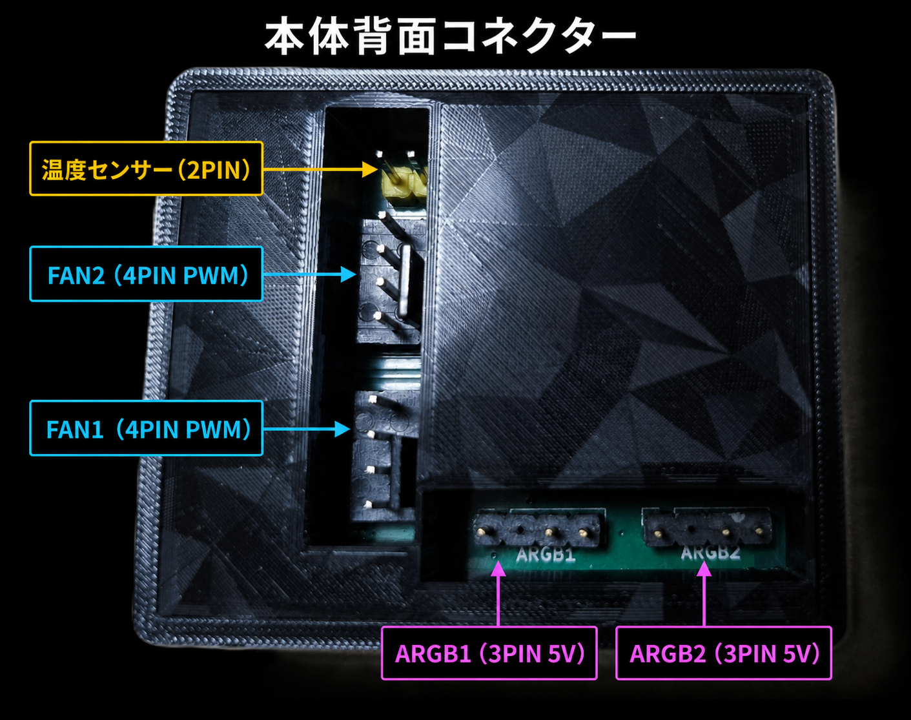

# Water Cooling Device with Dynamic Lighting

  <strong>本格水冷PCの水温に連動してファンを制御し、ARGBライティングまで一台に。</strong> 
  RP2040搭載 水温連動ファンコントローラー / ARGBコントローラー 
  Windows Dynamic Lighting対応

  

<table>
  <tr>
    <td width="32%" align="center">
       
      <strong>WCD-01 “LUNE”</strong> 
      Water Cooling Device Navigator
    </td>
    <td width="68%">
      <h2>はじめまして、LUNEです。</h2>
      
この装置は、水冷ループの水温を見ながらファンを自動制御するコントローラーです。PCから設定できますが、設定内容は本体へ保存されるため、Windowsアプリを閉じても冷却制御を続けます。

      <ul>
        <li><strong>冷やす：</strong>水温に合わせて2系統のPWM出力を制御</li>
        <li><strong>見る：</strong>水温、Duty、RPMを本体OLEDとWindowsで確認</li>
        <li><strong>光らせる：</strong>2系統のARGBをWindows Dynamic Lightingから操作</li>
        <li><strong>守る：</strong>高水温やセンサー異常時は両出力を100%へ固定</li>
      </ul>
    </td>
  </tr>
</table>

## 製品概要

Water Cooling Deviceは、RP2040を採用し、水温連動ファン制御、回転数監視、OLED表示、2系統のARGB制御を小型ボディに集約した、本格水冷PC向けのファンコントローラー兼ARGBコントローラーです。ARGBはWindows Dynamic Lightingに対応し、ケースによってはマザーボード裏側の配線スペースにも収納できます。

> **LUNE:** CPU温度の瞬間的な上下ではなく、冷却ループ全体の状態を表す水温を基準にファンを動かします。USB通信がない場合も、水温監視、ファン制御、RPM監視、OLED表示は本体だけで継続します。

付属する2個のハブにより、**ARGB機器を最大8台 × 2系統**、**4ピンPWMファンを最大8台 × 2系統**、合計各16台まで接続できます。

> [!NOTE]
> ファン制御はFAN1／FAN2の2系統です。同じハブに接続したファンは、同一のPWM設定で動作します。

| 冷却制御 | ライティング | モニター | ソフトウェア |
| --- | --- | --- | --- |
| 4ピンPWM × 2系統 | ARGB × 2系統 | 水温・Duty・RPM | Windows設定アプリ |
| 最大8台 × 2ハブ | 最大8台 × 2ハブ | OLED単体表示 | C#ソースコード公開 |
| 独立ファンカーブ | 系統別エフェクト | 本体設定保存 | 複数個体の識別対応 |

  

## 主な特長

- 水温に連動するFAN1／FAN2の独立ファンカーブ
- 水温、PWM Duty、RPMを確認できるOLEDディスプレイ
- 本体ボタンとWindowsアプリの両方から設定可能
- ARGB1／ARGB2をWindows上の別々のライティングデバイスとして認識
- Windows Dynamic Lighting対応
- SignalRGBでの動作確認済み（非公式）
- 本体ごとに固有のUSB Serial Numberを設定
- 設定内容を本体へ保存し、PCソフト終了後も自律制御

  
  

## フェイルセーフ

冷却トラブル時に安全側へ移行するため、次の条件を監視します。

| 発動条件 | 動作 |
| --- | --- |
| 水温が設定した警告温度を超過 | FAN1／FAN2をDuty 100%に固定 |
| 水温センサーの断線・短絡・異常値 | FAN1／FAN2をDuty 100%に固定 |

警告温度フェイルセーフは、設定温度より1℃下がるまで解除しないヒステリシス付きです。センサー異常時はOLEDへ `SENSOR ERROR!`、警告温度超過時は `HIGH WATER` を表示します。

<table>
  <tr>
    <td width="23%" align="center">
      
    </td>
    <td width="77%">
      <strong>LUNEの安全メモ</strong>  
      フェイルセーフ中は設定中のファンカーブより安全動作を優先し、FAN1／FAN2をDuty 100%へ固定します。ただし、本製品だけで水漏れ、ポンプ故障、流量低下など水冷システム全体の安全を保証するものではありません。定期的に水温、回転数、漏れ、ポンプ動作を確認してください。
    </td>
  </tr>
</table>

  

## Windowsアプリ

接続中の水温、PWM Duty、RPMをリアルタイム表示し、FAN1／FAN2のファンカーブや警告温度を設定できます。

> [!IMPORTANT]
> Windowsアプリの開発・配布における正本は、公開リポジトリ[`WaterCoolingDevice-Windows`](https://github.com/TKSLOTTY/WaterCoolingDevice-Windows)とそのReleaseです。ローカルに保存された旧版ZIPではなく、GitHub上の最新版を基準にしてください。

- USB Serial Numberによる複数台の識別・選択
- Windowsアプリの複数起動と同一個体の二重制御防止
- 選択個体を優先した自動再接続
- 日本語／英語の接続ステータス表示
- OLED表示画面と画面切替時間のプレビュー設定
- CPU使用率、メモリ使用率のOLED表示
- CPU／GPU温度の取得とOLED表示（任意）
- Windows起動時の自動起動と通知領域表示

Windowsアプリは[`v3.0.1-beta`のRelease](https://github.com/TKSLOTTY/WaterCoolingDevice-Windows/releases/tag/v3.0.1-beta)からダウンロードできます。通常は.NET 8を同梱した**Full版**、すでに.NET 8 Desktop Runtimeを導入している場合は小容量の**Minimal版**を選択してください。C#ソースコードと通信仕様は、このリポジトリの[`src/Windows_App`](https://github.com/TKSLOTTY/TKSLOTTY-WaterCoolingDevice/tree/main/src/Windows_App)で確認できます。

> [!NOTE]
> CPU／GPU温度取得はチェックボックスでON／OFFできます。CPU温度取得には署名済みPawnIOを使用しますが、CPUやマザーボードによっては取得できない場合があります。取得できない温度は表示されません。本アプリはWinRing0を同梱・使用しません。

> **LUNE:** Windowsアプリから受け取るCPU／GPU情報は追加表示用です。通信が途切れても、本体の水温連動ファン制御とフェイルセーフは止まりません。

  
  

## ARGB

ARGB1とARGB2は独立したLampArrayとして認識されるため、Windows Dynamic Lightingで系統ごとに異なるエフェクトを設定できます。各系統のLED構成は1～64灯の範囲で設定可能です。

SignalRGBでも動作を確認していますが、非公式対応のため、すべての環境やバージョンでの動作を保証するものではありません。

  
  

<strong>実験的機能：PUMPモード</strong>

FAN2を対応する4ピンPWMポンプ用の固定Duty出力として使用できます。ただし、この機能は実験的な位置付けであり、主機能・動作保証の対象外です。ポンプによって始動可能なDutyや制御仕様が異なるため、対応可否と確実に始動・連続回転できる設定を必ず実機で確認してください。設定によってはポンプが停止する可能性があります。

PUMPモード中は、Duty 35%以上かつ300 RPM未満の状態が5秒継続すると、補助的なフェイルセーフとしてFAN2をDuty 100%に固定します。この機能はポンプや水冷システム全体の安全を保証するものではありません。

## USB識別情報

- VID: `0x2E8A`
- PID: `0x1144`
- 製品ごとの固有USB Serial Number

VID／PIDは、Raspberry Pi財団より商用利用可能な固定番号として割り当てていただきました。このご厚意に心より感謝申し上げます。番号の割り当ては、Raspberry Pi財団による本製品の認定・保証を意味するものではありません。

本体の仮想USBドライブには、説明書、検査証、インストール手順、GitHubリンクを収録しています。

## セット内容

  

- コントローラー本体 × 1
- ハブ × 2（接続ケーブル類を含む）
- 水温センサーフィッティング × 1
- USB Type-C — マザーボード内部USB 2.0接続ケーブル × 1

水温センサーフィッティングは、GPUブロックやラジエーターの空きポートへ取り付けできます。

> [!IMPORTANT]
> 標準機能のファン端子は**4ピンPWMファン専用**です。3ピンファンには対応していません。PUMPモードは上記のとおり実験的機能です。

## 本体背面コネクターと接続

  

写真の向きで、左側の縦列は上から**温度センサー（2PIN）→ FAN2 → FAN1**、下側の横列は左から**ARGB1 → ARGB2**です。

> **LUNE:** 配線で特に間違えやすいのはARGBです。本製品は**3PIN 5V ARGB専用**で、4PIN 12V RGBは接続できません。各ハブの赤色FAN端子には、回転数を監視したいファンを接続してください。

1. 温度センサーフィッティングの2PINケーブルを温度センサー端子へ接続します。
2. ハブ1のFAN／ARGBケーブルを本体のFAN1／ARGB1へ接続します。
3. ハブ2のFAN／ARGBケーブルを本体のFAN2／ARGB2へ接続します。
4. 本体のUSB Type-Cケーブルを、マザーボード内部USB 2.0の空きヘッダーへ接続します。
5. 2個のハブそれぞれを、電源ユニットのSATA電源へ接続します。
6. 回転数を取得するため、各ハブの**赤色FAN端子**を必ず使用します。

> [!CAUTION]
> 配線はPCの電源を切った状態で行ってください。ARGBは**3PIN 5V専用**です。4PIN 12V RGB端子へ接続しないでください。水冷部品の取り付け後は、漏れと配線を確認してから電源を入れてください。

## ソフトウェア配布

- Windowsアプリ Full: `WaterCoolingDevice-Windows-v3.0.1-beta-full.zip`
- Windowsアプリ Minimal: `WaterCoolingDevice-Windows-v3.0.1-beta-minimal.zip`
- Windowsアプリ配布: [`WaterCoolingDevice-Windows`](https://github.com/TKSLOTTY/WaterCoolingDevice-Windows)
- 公開C#ソース: [`src/Windows_App`](https://github.com/TKSLOTTY/TKSLOTTY-WaterCoolingDevice/tree/main/src/Windows_App)
- AI／カスタムUI向け通信仕様: [`PROTOCOL_REFERENCE.md`](https://github.com/TKSLOTTY/TKSLOTTY-WaterCoolingDevice/blob/main/src/Windows_App/PROTOCOL_REFERENCE.md)

配布ファイルは[WindowsアプリのGitHub Releases](https://github.com/TKSLOTTY/WaterCoolingDevice-Windows/releases)から取得してください。利用・改変・再配布の条件は各リポジトリ内のライセンス文書をご確認ください。

---

## メルカリで販売中

**新品・検査済みのWater Cooling Device with Dynamic Lightingをメルカリで販売しています。** 先着5台には、設定ソフトウェアを収録したUSBメモリをおまけとして同梱します。

### [メルカリの商品ページを見る →](https://jp.mercari.com/item/m78224442303)

個人製作のオリジナル製品です。取り付け前に説明書を確認し、電源を切った状態で配線してください。水冷部品の取り付け後は、漏れがないことを確認してからPCを稼働させてください。
