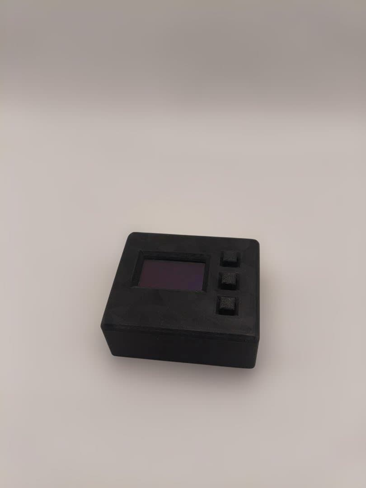
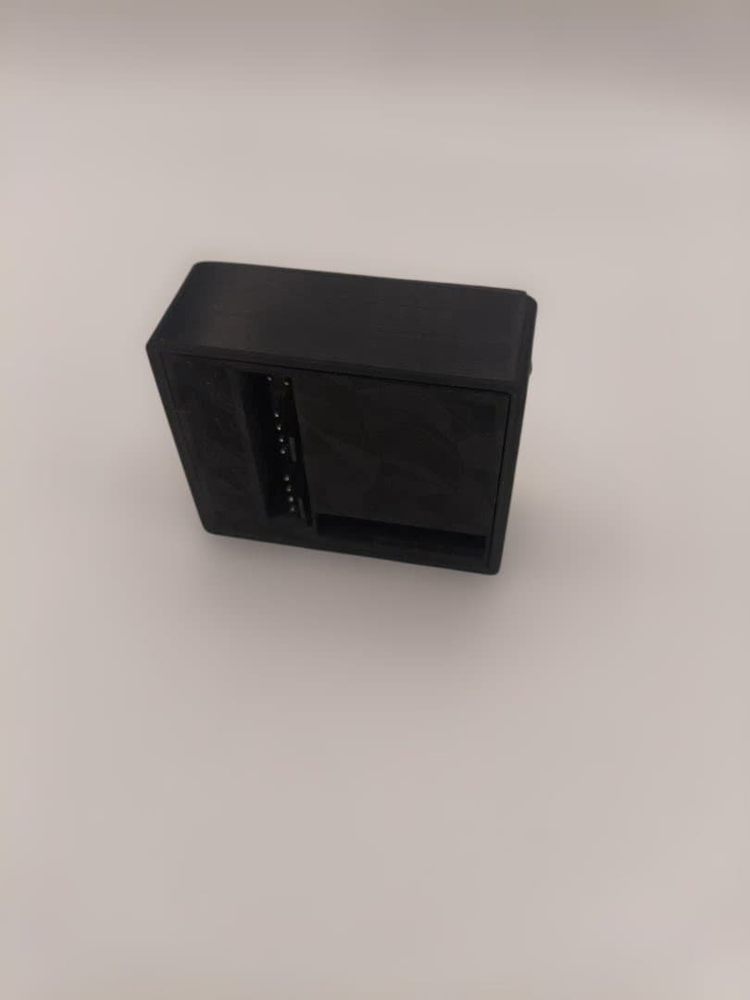
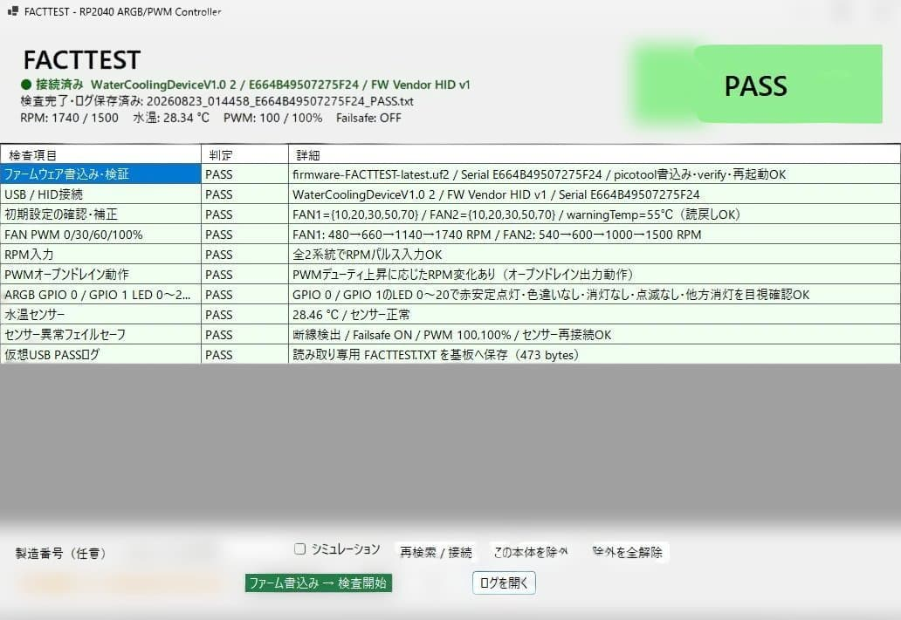
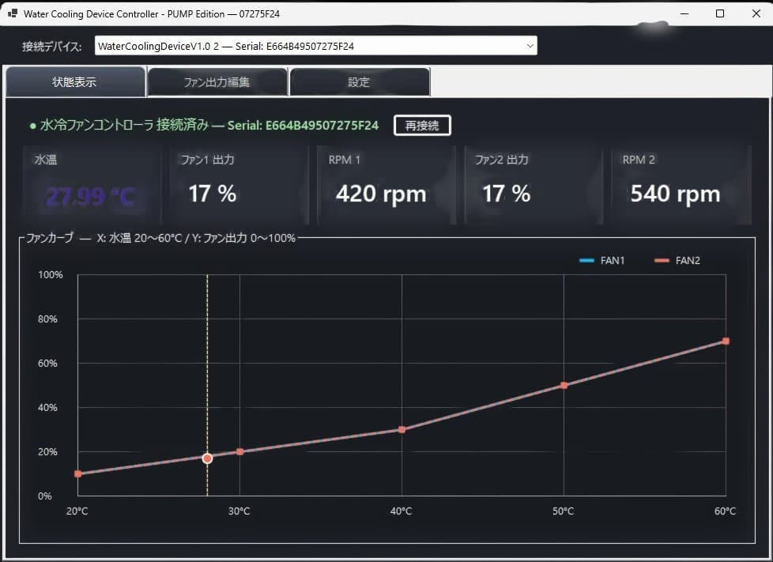
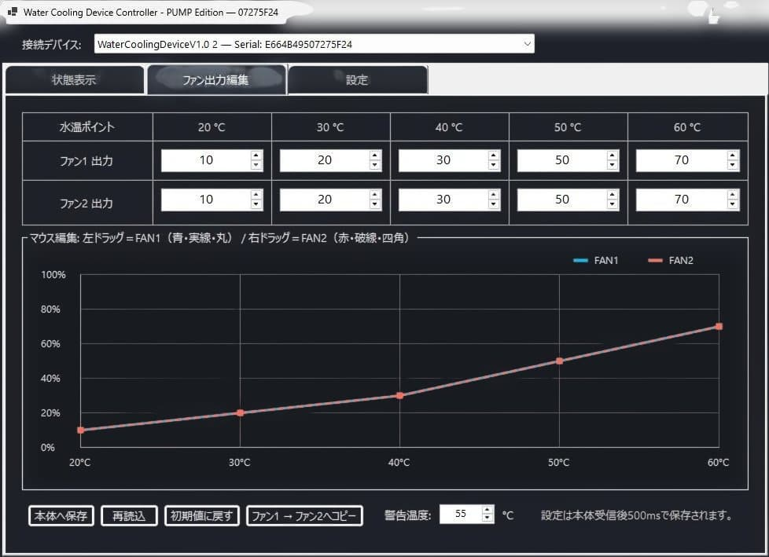

# Water Cooling Device — PUMP Edition

  <strong>水温を見て、ファンとポンプを動かし、異常時は安全側へ。</strong> 
  水冷PC向け PWM / ARGB コントローラー

  

## 製品概要

Water Cooling Deviceは、水温連動PWM制御、回転数監視、OLED表示、ARGB制御を小型ボディに集約した水冷PC向けコントローラーです。ケースによってはマザーボード裏側の配線スペースにも収納できます。

付属する2個のハブにより、**ARGB機器を最大8台 × 2系統**、**4ピンPWMファンを最大8台 × 2系統**、合計各16台まで接続できます。

> [!NOTE]
> ファン制御はFAN1／FAN2の2系統です。同じハブに接続したファンは、同一のPWM設定で動作します。

| 冷却制御 | ライティング | モニター | ソフトウェア |
| --- | --- | --- | --- |
| 4ピンPWM × 2系統 | ARGB × 2系統 | 水温・Duty・RPM | Windows設定アプリ |
| 最大8台 × 2ハブ | 最大8台 × 2ハブ | OLED単体表示 | C#ソースコード公開 |
| ファンカーブ／PUMPモード | 系統別エフェクト | 本体設定保存 | 複数個体の識別対応 |

  
  

## 主な特長

- 水温に連動するFAN1／FAN2の独立ファンカーブ
- FAN2をPWMポンプ用として使用できるPUMPモード
- 水温、PWM Duty、RPMを確認できるOLEDディスプレイ
- 本体ボタンとWindowsアプリの両方から設定可能
- ARGB1／ARGB2をWindows上の別々のライティングデバイスとして認識
- Windows Dynamic Lighting対応
- SignalRGBでの動作確認済み（非公式）
- 本体ごとに固有のUSB Serial Numberを設定
- 設定内容を本体へ保存し、PCソフト終了後も自律制御

  
  

## フェイルセーフ

冷却トラブル時に安全側へ移行するため、次の条件を監視します。

| 発動条件 | 動作 |
| --- | --- |
| 水温が設定した警告温度を超過 | FAN1／FAN2をDuty 100%に固定 |
| 水温センサーの断線・短絡・異常値 | FAN1／FAN2をDuty 100%に固定 |
| PUMPモードでDuty 35%以上かつ300 RPM未満が5秒継続 | FAN2をDuty 100%に固定 |

警告温度フェイルセーフは、設定温度より1℃下がるまで解除しないヒステリシス付きです。センサー異常時はOLEDへ `SENSOR ERROR!`、警告温度超過時は `WARNING TEMP!` を表示します。

  

## Windowsアプリ

接続中の水温、PWM Duty、RPMをリアルタイム表示し、FAN1／FAN2のファンカーブや警告温度、PUMPモードを設定できます。

- USB Serial Numberによる複数台の識別・選択
- Windowsアプリの複数起動と同一個体の二重制御防止
- 選択個体を優先した自動再接続
- 日本語／英語の接続ステータス表示

Windowsアプリは[Releases](https://github.com/TKSLOTTY/WaterCoolingDevice-PUMP-VID1144/releases)からダウンロードできます。C#ソースコードは[`src/Windows_App`](src/Windows_App)で公開しており、ライセンス条件の範囲内で用途に合わせたカスタマイズが可能です。

  
  

## ARGB

ARGB1とARGB2は独立したLampArrayとして認識されるため、Windows Dynamic Lightingで系統ごとに異なるエフェクトを設定できます。各系統のLED構成は1～64灯の範囲で設定可能です。

SignalRGBでも動作を確認していますが、非公式対応のため、すべての環境やバージョンでの動作を保証するものではありません。

  
  

## USB識別情報

- VID: `0x2E8A`
- PID: `0x1144`
- 製品ごとの固有USB Serial Number

VID／PIDは、Raspberry Pi財団より商用利用可能な固定番号として割り当てていただきました。このご厚意に心より感謝申し上げます。番号の割り当ては、Raspberry Pi財団による本製品の認定・保証を意味するものではありません。

本体の仮想USBドライブには、説明書、検査証、インストール手順、GitHubリンクを収録しています。

## セット内容

  

- コントローラー本体 × 1
- ハブ × 2（接続ケーブル類を含む）
- 水温センサーフィッティング × 1
- USB Type-C — マザーボード内部USB 2.0接続ケーブル × 1

水温センサーフィッティングは、GPUブロックやラジエーターの空きポートへ取り付けできます。

> [!IMPORTANT]
> ファン端子は**4ピンPWMファン専用**です。3ピンファンには対応していません。接続前にファンやポンプの仕様をご確認ください。

## ソフトウェア配布

- Windowsアプリ: `WaterCoolingDevice-App-v1.0.zip`
- Windowsアプリソース: `WaterCoolingDevice-Source-v1.0.zip`
- リポジトリ内ソース: [`src/Windows_App`](src/Windows_App)

配布ファイルは[GitHub Releases](https://github.com/TKSLOTTY/WaterCoolingDevice-PUMP-VID1144/releases)から取得してください。利用・改変・再配布の条件は[`licenses`](licenses)内の文書をご確認ください。

---

## メルカリで販売中

**新品・検査済みのWater Cooling Deviceをメルカリで販売しています。** 先着5台には、設定ソフトウェアを収録したUSBメモリをおまけとして同梱します。

### [メルカリの商品ページを見る →](https://jp.mercari.com/item/m78224442303)

個人製作のオリジナル製品です。取り付け前に説明書を確認し、電源を切った状態で配線してください。水冷部品の取り付け後は、漏れがないことを確認してからPCを稼働させてください。
